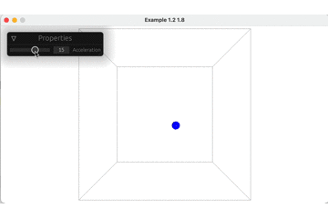
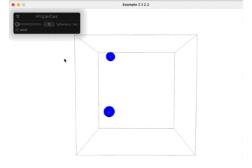
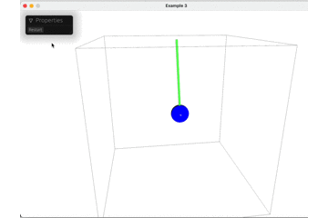
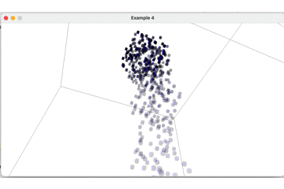
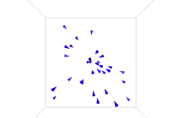

# rust-bevy and the Nature of Code

The book **The Nature of Code** from **Daniel Shiffman** is a wonderful book about programming.  

https://natureofcode.com/book/  

About many things you need to know when programing games.

My personal challenge is to make an example for every chapter in **Rust** with **Bevy** (https://github.com/bevyengine/bevy)

Thanks to https://github.com/iMplode-nZ/bevy-orbit-controls. Many lines of the module **orbitcamera.rs** are from that.

## chapter 1 _ Vectors

Book: https://natureofcode.com/book/chapter-1-vectors/

Video: https://www.youtube.com/watch?v=bKEaK7WNLzM&list=PLRqwX-V7Uu6ZV4yEcW3uDwOgGXKUUsPOM&index=10

<br><br><br><br><br><br><br><br><br><br><br><br><br><br>

## chapter 2 _ Forces

Book: https://natureofcode.com/book/chapter-2-forces/

<br><br><br><br><br><br><br><br><br><br><br><br><br><br>

## chapter 3 _ Oscillation

Book: https://natureofcode.com/book/chapter-3-oscillation/

<br><br><br><br><br><br><br><br><br><br><br><br><br><br>

## chapter 4 _ Particle Systems

Book: https://natureofcode.com/book/chapter-4-particle-systems/

<br><br><br><br><br><br><br><br><br><br><br><br><br><br>

## chapter 5 _ Autonomous Agentss

Book: https://natureofcode.com/book/chapter-6-autonomous-agents/

<br><br><br><br><br><br><br><br><br><br><br><br><br><br>


```Rust

```
